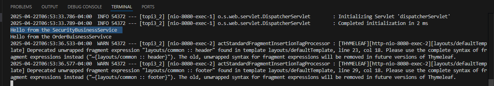
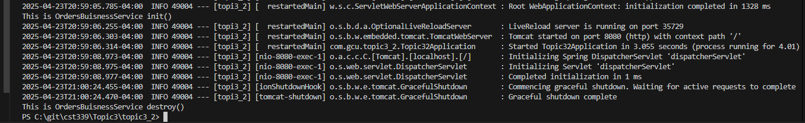
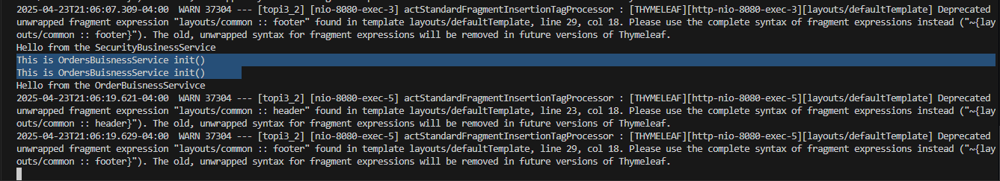
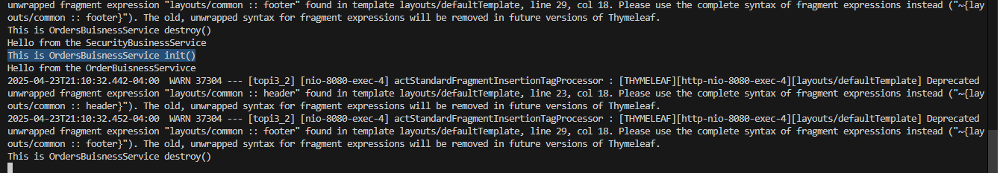
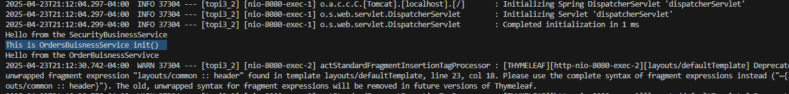
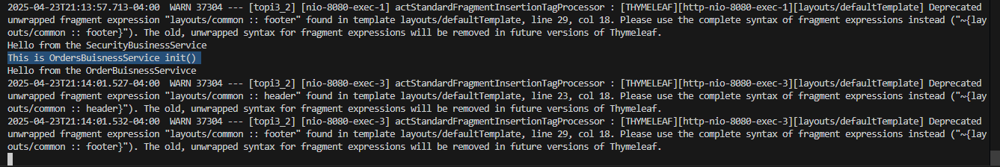
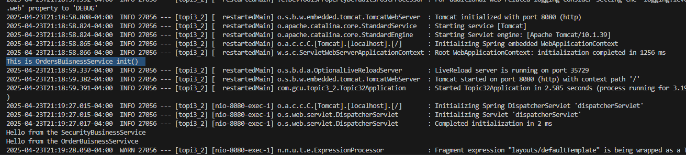

# Activity 3

- Author:  Charles Ackley
- Date:  4/23/2025

## Introduction

## Activity 2 Screenshots

#### Part 1: Creating Models, Views, and Controllers Using Spring MVC Screenshots

- **Hello OrdersBusinessService**

    

- **Hello AnotherOrdersBusinessService**

    

- **Hello SecurityBusinessService**

    

- **Orders Page Using OrdersBusinessService**

    

#### Part 2:Spring Bean Life Cycle and Scopes

- **OrdersBusinessService init() and destroy()**

    
    init() got called upon application start
    init() got called only once upon application start
    destroy() got called upon application end
    destroy() got called only once upon application end
    Next answer why

- **OrdersBusinessService @Scope Annotation**

    
    init() got called after submitting the login form
    init() got called twice after submitting the login form
    Next answer why

- **OrdersBusinessService @RequestScope Annotation**

    
    init() got called after submitting the login form
    init() got called only once after submitting the login form
    Next answer why

- **OrdersBusinessService @SessionScope Annotation**

    - ***Browser Session 1***
    

    - ***Browser Session 2***
    

    init() got called one time for each browser session
    init() got called after submitting the login form
    Next answer why

- **OrdersBusinessService Default Singleton Scope**

    
    init() got called upon application start
    init() got called only once upon application start
    Next answer why

#### Part 3: 

## Conclusion

