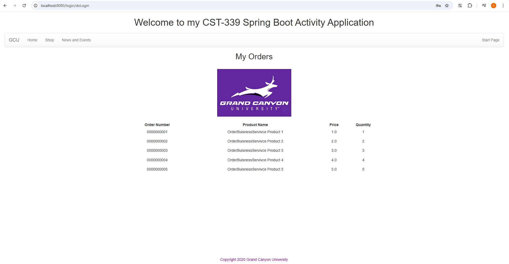

# Activity 3

- Author:  Charles Ackley
- Date:  4/23/2025

## Introduction

## Activity 2 Screenshots

#### Part 1: Creating Models, Views, and Controllers Using Spring MVC Screenshots

- **Hello OrdersBusinessService**

    

- **Hello AnotherOrdersBusinessService**

    

- **Hello SecurityBusinessService**

    

- **Orders Page Using OrdersBusinessService**

    

#### Part 2: 

#### Part 3: 

## Conclusion

