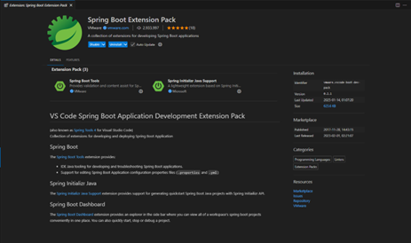
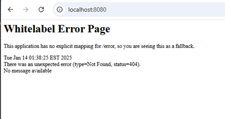
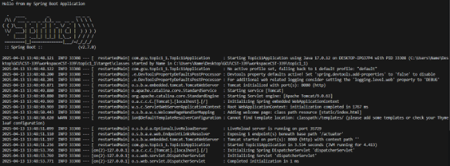
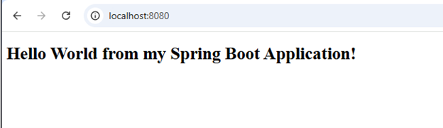
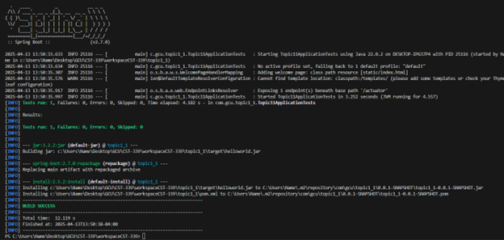
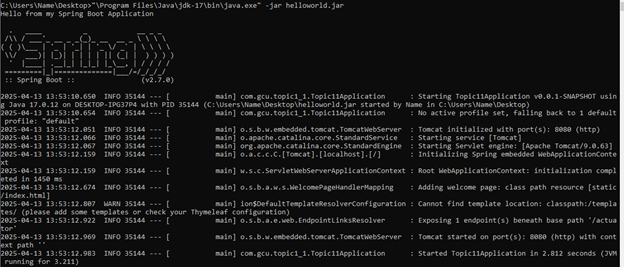

# Activity 1

- Author:  Charles Ackley
- Date:  4/13/2025

## Introduction

The goal of Activity 1 is to install and validate the necessary tools required to develop a SpringBoot application.

## Activity 1 Screenshots

- **Spring Tool Suite About Box**

    

- **Default Whitelabel Error Page**

    

- **Spring Boot Terminal**

    

- **Hello World Page**

    

- **Build Success Terminal**

    

- **Running Jar File in Terminal**

    
     
    

## Conclusion

In Activity 1 I successfully installed the tools needed for a SpringBoot application, created a simple application to test the tools, and covered the basics of Maven.