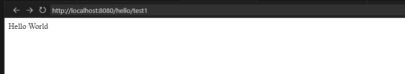
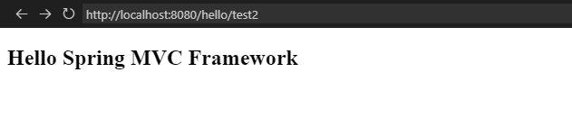
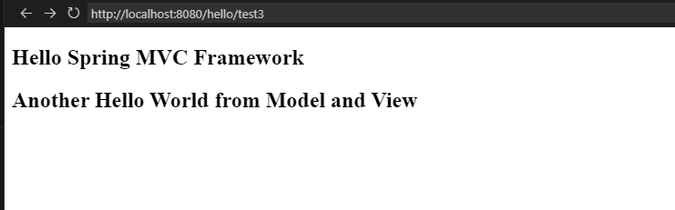
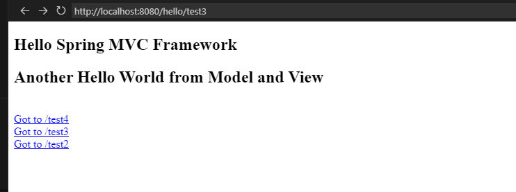
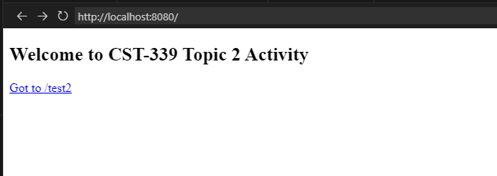
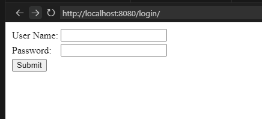
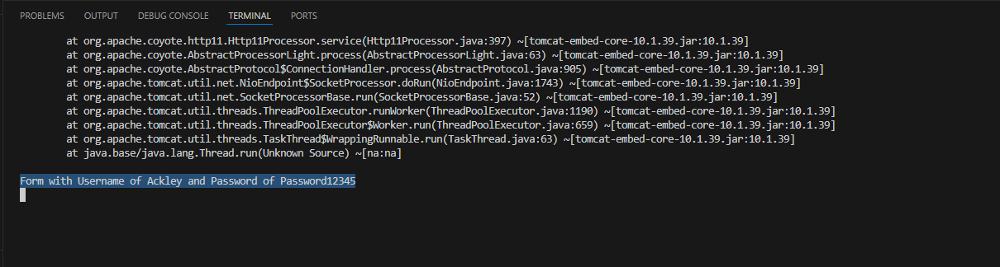
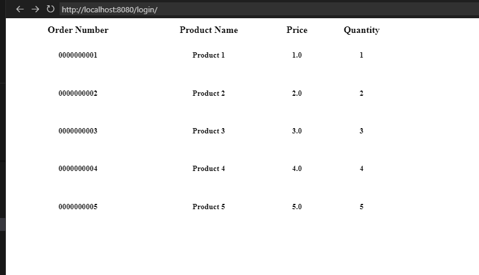
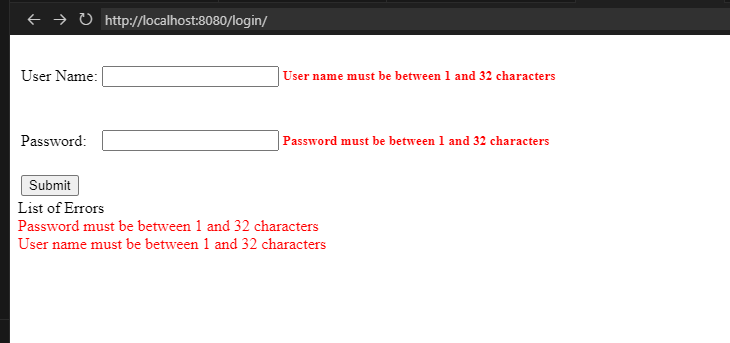

# Activity 2

- Author:  Charles Ackley
- Date:  4/15/2025

## Introduction

The goal of Activity 2 is to cover the basics of controllers, models, and views utilizing Apring MVC

## Activity 2 Screenshots

#### Part 1: Creating Models, Views, and Controllers Using Spring MVC Screenshots

- **Controller Request Method Hello World**

    

- **Controller Request Method Hello World Using Model Attriburte**

    

- **Controller Request Method Hello World Using Model And View**

    

- **Hello World Using Tymeleaf Template**

    

- **Hello World With Anchor Tags**

    

- **Home Page**

    

#### Part 2: Creating Forms with Data Validation Using Spring MVC Screenshots
- **Login Form With No Data Validation**

    

- **Login Form Values From Console**

    

- **Orders Page**
    

- **Login Form With Validation Errors**

    

#### Part 3: Creating Layouts Using Thymeleaf Screenshots

## Conclusion
